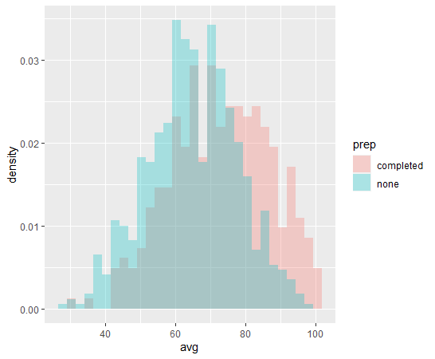
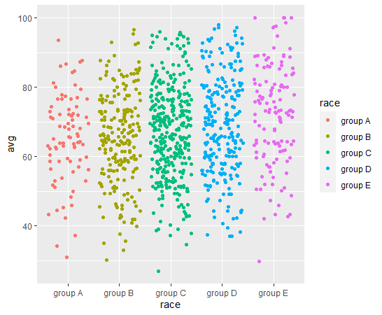
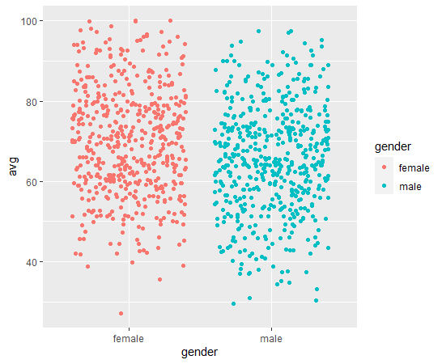

This is a small R project strictly for learning purposes. The goal was to explore a randomly generated dataset of exam scores along with various variables (generated at [this site](http://roycekimmons.com/tools/generated_data/exams)).

Steps included ensuring that data was in readable format for analysis, plotting graphs for visualization and hypothesis formation, and finally running tests to compare differences between groups to check for significant differences.

From line 81 onwards, I tried to create a linear regression model to be able to predict scores for additional data. However, as all the predictors are categorical, I found creating a model difficult and thus did not proceed any further. I have left the code and comments in case I wish to explore this issue further and also so anyone who reads it might be able to follow my thought process.

The following graphs were created to visualize the average scores across different variables (prep, race, gender):

(Note: y-axis on this graph is density because the number of students who did not take the prep course is around 2x those who did)

